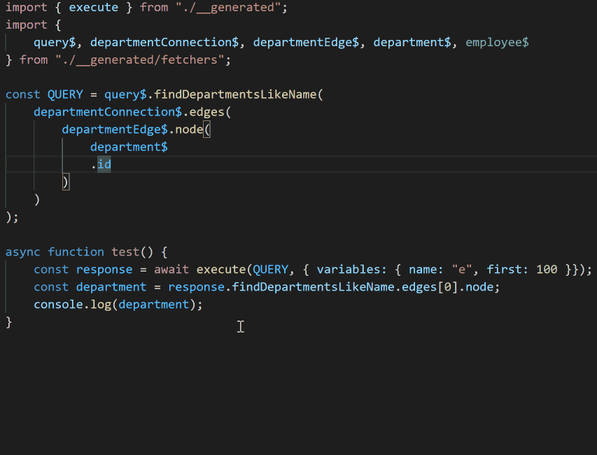

A new GraphQL client for TypeScript. it's TypeScript-DSL for GraphQL with full features.

1. Supports GraphQL queries with strongly typed code.
2. **Automatically infers the type of the returned data according to the strongly typed query request**, This is the essential difference between this framework and other similar frameworks, and it is also the reason why I created it.
3. Because of point 2, unlike other client-side code generation tools and relay-compiler, **the code generation work is one-time**. Once the code is generated, it can be developed continuously until the server interface changes, without the need to generate code again and again.

# Get started

1. [Step-by-step guide with nothing](get-start-async.md)
2. [Step-by-step guide with apollo](get-start-apollo.md)
3. [Step-by-step guide with relay](get-start-relay.md)
4. [Step-by-step guide with graphql-state](get-start-graphql-state.md) **(Suggested)**
   [graphql-state](https://github.com/babyfish-ct/graphql-state) is a collaborative framework tailored for graphql-ts-client, and is a complete react state management framework.
   **graphql-state is very smart, After mutation, there is no need to manually update the local cache, nor to specify which queries need to be refetched, everything is automatic**

# Documentation
[English Documentation](doc/README.md) | [中文文档](doc/README_zh_CN.md)

# Notes

*My npm packages are 'graphql-ts-client-api', 'graphql-ts-client-codegen' and 'graphql-ts-client-relay'. There is another package named 'graphql-ts-client' in npm repository, but that's not my framework.*

# Contact me
babyfish.ct@gmail.com
