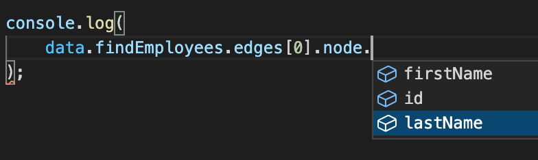

# Fetcher

Fetcher是本框架的核心概念。对于GraphQL中的每一个ObjectType，都会生成一个Fetcher，包含Query和Muation

假如代码生成器中配置目标目录为"src/__generated"，那么所有的fetcher都位于"src/__generated/fetchers"

本框架有三种使用方式
1. 独立使用
2. 和@apollo/client配合使用
3. 和relay配合使用

为了便于讨论，除了后面的SpreadFragment章节外，都是用独立使用的方式讲解。下文中所有的fetcher取自[example/client/async-demo/src/__generated/fetchers](example/client/async-demo/src/__generated/fetchers)，也会用到[example/client/async-demo/src/__generated/Async.ts](example/client/async-demo/src/__generated/Async.ts)中的execute函数

##1. 基本使用

```ts
import { execute } from "./__generated";
import { employee$, employeeConnection$, employeeEdge$, query$ } from "./__generated/fetchers";

const data = await execute(
    query$.findEmployees(
        employeeConnection$.edges(
            employeeEdge$.node(
                employee$
                .id
                .firstName
                .lastName
            )
        )
    )
);
```

你可以在IDE中得到如下效果
